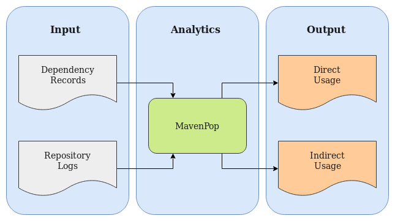

# MavenPop

Big Data application to determine Maven artifacts popularity taking into account transitive dependencies

This is an experiment at an early stage.


## System Overview

Maven is used widely in packaging and distribution of many open source projects and Maven repository server logs can be used to extract valuable information about the community adoption of new software releases.

Maven is able to resolve transitive dependencies and, therefore, performing simple counting techniques does not provide insight on direct user choices, since an artifact could be popular because it is a common (transitive) dependency of other artifacts. The aim of this project is to take into consideration transitive dependencies to calculate artifact popularity, differentiating “direct usages” or top level dependencies from the “indirect usages” or transitive dependencies.

The following image is an overview of the system:



MavenPop is a Big Data Analytics application that receives “Dependency Records” and “Repository Logs” and generates popularity information on direct and indirect usage of the artifacts.

Dependency Records contain Maven repository coordinates of the artifacts along with a list of the dependencies of each artifact. The dependencies are also in Maven coordinates format. For the cases the dependencies of a given artifact are not known, MavenPop expects a special value instead of the list of dependencies. Repository Logs comprise a client identifier (generated from anonymized IP addresses for example), artifact path and a timestamp indicating the exact time the client retrieved the given artifact.

MavenPop uses the dependency records to build a dependency graph of all known artifacts. It builds sessions of consecutive retrievals from the repository logs and use the dependency graph to determine which artifacts from each session are direct choice from the users. Direct and indirect choices are aggregated in users per day and saved in a comma-separated-values files corresponding to “Direct Usage” and “Indirect Usage”.

It is possible to specify the maximum idle time and the report date.
Maximum idle time represents the maximum time a user can spend between two retrievals for them to be considered part of the same session.

## Data Representation

### Dependency Records

MavenPop expects the dependency records in the following format:
```bash
{occurrences, relative path, GAV coordinates, dependencies}
```
Where occurences is the number of times the artifact appears in the repository logs,
relative path is the path to the artifact,
GAV coordinates is the artifact identifier in the maven repositories,
and dependencies is the list of GAVs that the artifact depends on.
The 'dependencies' field can also adopt the special values
UNKNOWN_DEPS (there is no known dependencies for this artifact )
or (NO_DEPS) when it is known that the artifact does not have any dependency

For example:
```bash
3221 rome/rome/1.0/rome-1.0.pom rome:rome:1.0 jdom:jdom:1.0,junit:junit:3.8.2
325 com/c2/fit/fit/1.1/fit-1.1.pom com.c2.fit:fit:1.1 junit:junit:3.8.1
1645 jboss/jbpm/3.1.1/jbpm-3.1.1.pom jboss:jbpm:3.1.1 NO_DEPS
2329145 org/codehaus/mojo/maven-metadata.xml org.codehaus:mojo UNKNOWN_DEPS
```

### Repository Logs

MavenPop expects the repository logs in the following format:

```bash
{client ID, timestamp, agent, artifact}
```
Where client ID is the identifier generated for a client based on its IP address,
timestamp is the number of milliseconds ellapsed since 1st January 1970,
agent is the connector the client is using to access the repository and
artifact is the software component requested

For example:
```bash
427 1433855407000 m2e junit/junit/3.8/junit-3.8.pom
673 1403637289000 Maven javax/mail/mail/1.4/mail-1.4-sources.jar
2530 1274090245000 Ivy org/jboss/jboss-parent/3/jboss-parent-3.pom
839 1399622120000 Nexus org/codehaus/mojo/maven-metadata.xml
```

### Output Report

MavenPop generates 2 CSV files per report date with the name <report_date>\_direct.csv and <report_date>\_indirect.csv.
Each file contains the aggregations of artifacts direct (top level dependency in session) and indirect (transitive dependency in session) usage.
report\_date is in the format YYYY-MM-DD. Both files have data in the format:

```bash
{artifact, users_count}
```
Where artifact is the maven coordinates of the software component retrieved,
and users_count is the amount of distinct users that retrieved this artifact.

Example:

- filename: 2018-05-13_direct.csv
```bash
org.apache.maven.plugins:maven-install-plugin,3
org.jvnet.staxex:stax-ex,4
```

- filename: 2018-05-13_indirect.csv
```bash
org.drools:knowledge-internal-api:5.4.0.Final,1
org.drools:drools-core:5.4.0.Final,1
```
## Usage

### Prerrequisites

Following the list of prerrequisites along with the links to download them.
Please install all of them in the server following each link installation
instructions:

| Prerequisite      | Version | Link            
|---                |---      |---
| SBT               | 1.1.5   | <https://www.scala-sbt.org/download.html>
| JRE               | 1.8     | <https://docs.oracle.com/javase/8/docs/technotes/guides/install/linux_jre.html#A1096865>
| Scala             | 2.11.8  | <https://www.scala-lang.org/download/2.11.8.html>
| Spark             | 2.3.0   | <https://spark.apache.org/downloads.html>
| Neo4j Server CE   | 3.4.1   | <https://neo4j.com/download-center/#releases>

After downloading and installing the prerrequisites export environment variables with the installation paths,
and include the binaries in the PATH  variable. This is an example of how the ~/.bash_profile may look like to accomplish this:

```
JAVA_HOME=/usr/local/jdk1.8.0_172
SBT_HOME=/path/to/sbt
NEO4J_HOME=/path/to/neo4j-community-3.4.1
SCALA_HOME=/path/to/scala-2.11.8
SPARK_HOME=/path/to/spark-2.3.0-bin-hadoop2.7
BASE_PATH=/usr/local/bin:/usr/local/sbin:/usr/bin:/usr/sbin

PATH=$JAVA_HOME/bin:$M2_HOME/bin:$SCALA_HOME/bin:$SBT_HOME/bin:$NEO4J_HOME/bin:$BASE_PATH

export JAVA_HOME SCALA_HOME SPARK_HOME NEO4J_HOME PATH TERM

```
### Build

Download latest release: <https://github.com/hceduardo/mavenpop/archive/v0.1.tar.gz>,
download dependencies, run unit tests and deploy the jar file containing all dependencies:

```bash
wget https://github.com/hceduardo/mavenpop/archive/0.1.tar.gz
tar xfz 0.1.tar.gz && cd mavenpop-0.1
sbt update
sbt assembly
```

At the end of the assembly task output is the path of the generated jar, in this case at `target/scala-2.11/mavenpopcore-assembly-0.1.jar`

Copy executable and configuration files to another working directory for easier handling:

```bash
mkdir ../mavenpop-run && \
cp target/scala-2.11/mavenpopcore-assembly-0.1.jar \
conf/demo.conf \
scripts/import_and_start_neo.bash \
src/main/resources/log4j.properties \
../mavenpop-run && \
cd ../mavenpop-run
```

Create input and output directories, copy input files and adjust path configuration in .conf file accordingly.
Alternatively you may create symbolic links of input files with `ln -s` instead of copying:
```bash
mkdir out && mkdir in && cd in
cp /path/to/dependency-records/distinct_paths_inferred_gavs_with_deps.txt .
mkdir repologs && cd repologs
cp /path/to/repologs/part-0000 .
```

Create spark history server working directory
```bash
mkdir /tmp/spark-events
```


Modify the demo.conf file to match your input directory names ('repologs' and 'dependencies'), desired output paths and report dates.

```bash
cd ..
vi demo.conf
```

For this example the configuration would be:

```
mavenpop{

  date{
    start = "2009-12-11T00:00Z"
    end = "2010-02-10T00:00Z"
  }

  path{
    dependencies = "in/distinct_paths_inferred_gavs_with_deps.txt"
    repologs = "in/repologs/*"
    gavlogs = "out/gavlogs-demo.parquet"
    sessions = "out/sessions-demo.parquet"
    enhancedSessions = "out/sessions-enhanced-demo.parquet"
    reportDir = "out/reports/"
  }

  [...]
```

Following examples of the input:

Dependency Records

```bash
$ cd in
$ more distinct_paths_inferred_gavs_with_deps.txt

76834 xalan/xalan/2.6.0/xalan-2.6.0.pom xalan:xalan:2.6.0 xml-apis:xml-apis:2.0.2,xerces:xercesImpl:2.6.0
72376 xalan/xalan/2.7.1/xalan-2.7.1.pom xalan:xalan:2.7.1 xalan:serializer:2.7.1,xerces:xercesImpl:2.9.0
43819 cglib/cglib/2.2/cglib-2.2.pom cglib:cglib:2.2 asm:asm:3.1,asm:asm-util:3.1,ant:ant:1.6.2
2329145 org/codehaus/mojo/maven-metadata.xml org.codehaus:mojo UNKNOWN_DEPS
227468 javax/transaction/jta/1.1/jta-1.1.pom javax.transaction:jta:1.1 NO_DEPS
41057 ant/ant/1.6.5/ant-1.6.5.pom ant:ant:1.6.5 xerces:xercesImpl:2.6.2,xml-apis:xml-apis:1.3.04
39598 javax/mail/mail/1.4.2/mail-1.4.2.pom javax.mail:mail:1.4.2 javax.activation:activation:1.1,junit:junit:4.3.1
33245 com/sun/mail/all/1.4.2/all-1.4.2.pom com.sun.mail:all:1.4.2 javax.activation:activation:1.1,junit:junit:4.3.1
32948 xalan/xalan/2.7.0/xalan-2.7.0.pom xalan:xalan:2.7.0 xml-apis:xml-apis:2.0.2,xerces:xercesImpl:2.6.0
24912 stax/stax/1.2.0/stax-1.2.0.pom stax:stax:1.2.0 stax:stax-api:1.0.1,junit:junit:3.8.1
```

Repository Logs

```bash
$ more repologs/part-00000

79 1403074209000 m2e egovframework/com/ems/sndng-mail/1.0/sndng-mail-1.0.jar
79 1403074209000 m2e com/oracle/ojdbc14/10.2.0.4.0/ojdbc14-10.2.0.4.0.jar
79 1403141587000 m2e log4j/log4j/1.3alpha-8/log4j-1.3alpha-8.pom
79 1403141615000 m2e jakarta-regexp/jakarta-regexp/1.5/jakarta-regexp-1.5.pom
79 1403141633000 m2e net/sf/log4jdbc3/1.1/log4jdbc3-1.1.pom
79 1403141644000 m2e log4j/log4j/1.3alpha-8-374949/log4j-1.3alpha-8-374949.pom
79 1403141658000 m2e apache-taglibs/standard/1.1.2/standard-1.1.2.pom
79 1403141680000 m2e egovframework/com/ems/sndng-mail/1.0/sndng-mail-1.0.pom
79 1403143410000 m2e org/terracotta/forge/forge-parent/2.0/forge-parent-2.0.pom
79 1403143535000 m2e log4j/log4j/1.3alpha-8/log4j-1.3alpha-8.jar
```

### Overview of Entry Points

Following the list of all entry points of the application along with an overall description of their functions.
\*App are console applications and \*Job are Spark Batch Jobs:

1. DependencyParserApp: creates input files to populate dependency data structure
2. GavResolverJob: Takes repository logs and resolve the paths in them into maven coordinates
3. SessioniserJob: Groups consecutive dowloads into sessions
4. DependencyComputerJob: Add transitive dependencies list to sessions
5. Reporter Job: Create CSV reports of direct and indirect use

### 1. Load Dependency Structure

Generate the nodes and relationships to be imported to the graph database:

```bash
cd /path/to/mavenpop-run

java -Xmx5G -Xms5G -Dconfig.file=demo.conf \
-jar mavenpopcore-assembly-0.1.jar \
in/distinct_paths_inferred_gavs_with_deps.txt \
out/neo-nodes.txt \
out/neo-rels.txt
```

Import nodes and relationships to the database, specifying the database name, bolt port that the database will listen and the transaction timeout.

Relevant logs are stored in log/mavenpop.log

Please note the specified database will be deleted if it exists.

```bash
./import_and_start_neo.bash \
out/neo-nodes.txt \
out/neo-rels.txt \
dep-transitive.db \
17687 \
4s \
| tee log/importer-transitive.log
```

### 2. Resolve Gavs

To resolve gavs from repologs specified:

```bash
$SPARK_HOME/bin/spark-submit \
--class com.redhat.mavenpop.GavResolver.GavResolverJob \
--deploy-mode client \
--driver-memory 80g \
--driver-java-options "-Dconfig.file=demo.conf -Dlog4j.configuration=file:log4j.properties" \
mavenpopcore-assembly-0.1.jar
```

Takes input `mavenpop.path.repologs` and `mavenpop.path.dependencies` to generate a Spark parquet file named `mavenpop.path.gavlogs`
Mavenpop application logs are saved to log/mavenpop.log

### 3. Generate Sessions

To group "gavlogs" into sessions:

```bash
$SPARK_HOME/bin/spark-submit \
--class com.redhat.mavenpop.Sessioniser.SessioniserJob \
--deploy-mode client \
--driver-memory 80g \
--driver-java-options "-Dconfig.file=demo.conf -Dlog4j.configuration=file:log4j.properties" \
mavenpopcore-assembly-0.1.jar
```

Takes input `mavenpop.path.gavlogs` to generate a Spark parquet file named `mavenpop.path.sessions` containing sessions of consecutive gav retrievals per user. Two retrievals are considered consecutive if the time spent between retrievals does not exeeds the configration value of `mavenpop.sessioniser.maxIdleMillis` milliseconds

Mavenpop application logs are saved to log/mavenpop.log
Spark logs are saved to log/mavenpop-spark.log

### 4. Compute Dependencies

To generate the list of gavs that are dependencies of other gavs within each session:

```bash
$SPARK_HOME/bin/spark-submit \
--class com.redhat.mavenpop.DependencyComputer.DependencyComputerJob \
--deploy-mode client \
--driver-memory 80g \
--driver-java-options "-Dconfig.file=demo.conf -Dlog4j.configuration=file:log4j.properties" \
mavenpopcore-assembly-0.1.jar
```

Takes input `mavenpop.path.sessions` to generate a Spark parquet file named `mavenpop.path.enhancedSessions` containing an additional column with the list of dependencies for each session. The configration value of `mavenpop.dependencyComputer.depth` specifies the maximum depth the dependency tree of each gav is analised to. If the parser wrote the transitive dependencies (`mavenpop.parser.writeTransitve` = true ) this value should be one, so the appropriate relationship Label is used in the queries to the graph database.

Mavenpop application logs are saved to log/mavenpop.log
Spark logs are saved to log/mavenpop-spark.log

### 5. Generate the Reports

To generate the reports with direct and indirect usage per gav per date period:

```bash
$SPARK_HOME/bin/spark-submit \
--class com.redhat.mavenpop.Reporter.ReporterJob \
--deploy-mode client \
--driver-memory 80g \
--driver-java-options "-Dconfig.file=demo.conf -Dlog4j.configuration=file:log4j.properties" \
mavenpopcore-assembly-0.1.jar
```

Takes input `mavenpop.path.enhancedSessions` parquet to generate a CSV files in the directory `mavenpop.path.reportDir`. The filename is in the form `<start-date>_<end-date>_<type>.csv` where type is either "direct" or "indirect"

Mavenpop application logs are saved to log/mavenpop.log
Spark logs are saved to log/mavenpop-spark.log

For the configuration specified in demo.conf, these would be the output:

```bash
$ cd out/reports/ && ls
2009-12-11T00:00Z_2010-02-10T00-00Z_direct.csv  
2009-12-11T00:00Z_2010-02-10T00-00Z_indirect.csv
```

Top 10 direct usages:

```bash
$ cat 2009-12-11T00-00Z_2010-02-10T00-00Z_direct.csv/*.csv | head -10
org.slf4j:slf4j-parent:1.4.2,5
commons-io:commons-io:1.4,4
asm:asm-parent:3.0,4
org.apache.commons:commons-parent:11,4
org.apache.maven:maven:2.0.5,4
org.apache.maven.shared:maven-shared-components:7,4
org.hibernate:hibernate-validator-parent:4.0.2.GA,3
org.apache.maven.reporting:maven-reporting:2.0.4,3
org.hibernate:hibernate-parent:3.3.0.SP1,3
org.apache.maven.reporting:maven-reporting-impl:2.0.4,3
```

Top 10 indirect usages:
```bash
$ cat 2009-12-11T00-00Z_2010-02-10T00-00Z_indirect.csv/*.csv | head -10
org.hibernate:ejb3-persistence:1.0.2.GA,7
dom4j:dom4j:1.6.1,6
xml-apis:xml-apis:1.0.b2,6
org.slf4j:slf4j-api:1.4.2,5
org.hibernate:hibernate-annotations:3.4.0.GA,5
commons-logging:commons-logging:1.0,5
commons-collections:commons-collections:3.1,5
commons-beanutils:commons-beanutils:1.7.0,5
commons-beanutils:commons-beanutils:1.6,5
commons-collections:commons-collections:2.1,5
```

### Housekeeping

1. Clean intermediate output files when not needed (out/ directory)
2. Clean /tmp/spark-events
3. Clean logs/ directory

### Configuration

| Property Name            | Meaning
| ---                      |---
| mavenpop.spark.masterUrl | Spark jobs master URL
| mavenpop.spark.enableEventLog | Enable events logging for spark history server
| mavenpop.date.start | Start date for the report in format yyyy-MM-dd'T'HH:mmX
| mavenpop.date.end | End date for the report in format yyyy-MM-dd'T'HH:mmX
| mavenpop.path.repologs | Input path of repository logs
| mavenpop.path.dependencies | Input path of dependency records
| mavenpop.path.gavlogs | Output path of GavResolverJob: repository logs with resolved gavs
| mavenpop.path.sessions | Output path of SessioniserJob: repository logs grouped in sessions
| mavenpop.path.enhancedSessions | Output path of DependencyComputerJob: sessions enhanced with list of dependencies per session
| mavenpop.path.sampleSessionsPrefix | Profiling parameter, used to build the path of sample sessions
| mavenpop.path.sessionsBenchmarksPrefix | Profiling parameter, used to build benchmarks path. Parquet containing the anaylitics execution time per session to determine its dependencies  
| mavenpop.path.reportDir | Ouptut dir for ReporterJob. Contains CSV files with the final report
| mavenpop.sessioniser.maxIdleMillis | Used to group repository logs into sessions: Maximum idle time between two retrievals for them to be considered consecutive
| mavenpop.dependencyComputer.neo4j.boltUrl | BOLT URL to Neo4j Server
| mavenpop.dependencyComputer.neo4j.username | Neo4j database username
| mavenpop.dependencyComputer.neo4j.password | Neo4j database password
| mavenpop.dependencyComputer.profiler.sessionSize.start | Used by the profiler to build sessions samples
| mavenpop.dependencyComputer.profiler.sessionSize.end | Used by the profiler to build sessions samples
| mavenpop.dependencyComputer.profiler.sessionSize.step | Used by the profiler to build sessions samples
| mavenpop.dependencyComputer.profiler.samplesPerSize | Used by the profiler to build sessions samples
| mavenpop.dependencyComputer.profiler.depth.start | Used by the profiler to build sessions samples
| mavenpop.dependencyComputer.profiler.depth.end | Used by the profiler to build sessions samples
| mavenpop.dependencyComputer.profiler.depth.step | Used by the profiler to build sessions samples
| mavenpop.dependencyComputer.profiler.useCacheSamples | If true, the profiler used previously cached samples if they exists
| mavenpop.dependencyComputer.profiler.cacheSamples | If true, the profiler makes a cache of samples
| mavenpop.parser.writeTransitive | If true, the transitive dependencies are computed and writen to database
| mavenpop.dependencyComputer.depth | Depth used to compute dependencies in a session
| mavenpop.parser.label.gav | Label for the gavs nodes in graph database  
| mavenpop.parser.label.directDependency | Label for the direct dependency relationship in graph database
| mavenpop.parser.label.transitiveDependency | Label for transitive dependency relationship in graph database


